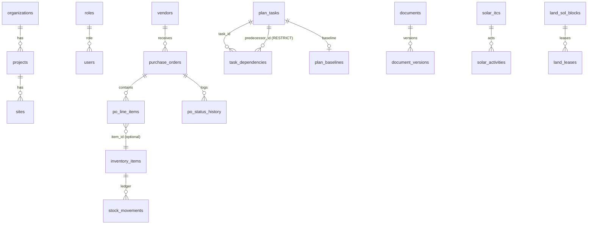

# SCHEMA.md — Postgres schema reference (Supabase build)

One migration file: **`sql/schema.sql`** (idempotent; safe to re-run). Seed data:
**`sql/seed.sql`**, generated from `firebase-seed.json` by `tools/convert-seed.py`.

## Entity-relationship overview

Every business table carries `project_id uuid default demo_project_id()` →
`projects`, making the schema multi-project ready without touching the UI
(the demo runs single-project; queries do not filter by project yet).

## Tables

### Tenancy & identity
| Table | Purpose | Key columns |
|---|---|---|
| `organizations` | tenant root | `id`, `name` |
| `projects` | project per org | `org_id→organizations`, `code` (unique), `capacity_mw` |
| `sites` | site per project | `project_id→projects`, `lat/lng` |
| `roles` | role lookup (9 roles) | `key` pk, `label` |
| `users` | mirrors `auth.users`; **one role per user** | `id` (= auth.users.id), `email`, `name`, `role→roles` |

> **Deliberate deviation, stated per the brief:** the prompt lists a
> `user_roles` join table. The app's real permission model is single-role
> (`auth.canEdit` compares one role string), so a many-to-many table would
> misrepresent the model and add join cost with no consumer. `roles` exists
> as a lookup; converting to `user_roles` later is a 5-line migration.

### Operations
| Table | Legacy RTDB path | Notes |
|---|---|---|
| `pod_entries` | `/pod/{date}/{push}` | date is a `pod_date` column, not a key; `resources jsonb` = `[{type,qty}]`; status `nys/wip/done` CHECK |
| `next_day_plans` | `/nextDayPlan/{date}` | |
| `daily_progress` | `/dailyProgress` | union of both historical entry shapes |
| `solar_itcs` | `/solar/itcs/{id}` minus `acts` | `data jsonb` (live{}, solActs{}, mw, …) |
| `solar_activities` | `/solar/itcs/{id}/acts/{i}` | pk `(itc_id, idx)`; `done/today/sub_scope` columns, `sub_done jsonb` |
| `wtg_turbines` | `/wtg/turbines/{id}` | `data jsonb` + generated indexed `status` column |
| `bop_activities` | `/bop/acts`, `acts66`, `pss/acts`, `gss/acts` | pk `(section, act_key)`; `data jsonb` is a stage array or `{scope,done,wip,…}` per section |
| `bop_assets` | `/bop/feeders33`, `lines33`, `poles33` | pk `(section, asset_key)` |
| `land_wtg_locs` / `land_sol_blocks` / `land_leases` / `land_parcels` | `/land/*` | leases are first-class rows FK'd to their block |
| `hse_observations` / `hse_employees` | `/hse/*` | `legacy_id` keeps the old `-hse_obs_001` keys addressable; unknown legacy keys land in `extra jsonb` |
| `milestones` / `blockers` / `row_issues` | roots | `legacy_id` for seed keys; CHECK constraints on type/status |
| `snapshots` | `/snapshots/{date}` | `snap_date` pk, `data jsonb` |
| `module_state` | fixed config paths | key→jsonb for `ganttRows`, `schedule`, `solar/meta`, `solar/customActs`, `solar/itcMaps`, `wtg/zeroPoint`, `wtg/customActs`, `wtg/kpiOverrides`, `wtg/meta`, `bop/meta` |
| `notifications` | `/notifications` | `read_by jsonb` per-uid map; marked via RPC |

### v11 modules
| Table | Notes |
|---|---|
| `vendors` | rating CHECK 0–5, status `active/archived` |
| `purchase_orders` | status CHECK `draft/approved/delivered/closed/cancelled`; `vendor_name` **denormalized on purpose** (commercial record as-of-issue); indexed on `vendor_id`, `status` |
| `po_line_items` | `qty>0`, `rate>=0` CHECKs; cascade with PO |
| `po_status_history` | trigger writes the initial `draft` row; RPC writes transitions — the table is not client-writable |
| `inventory_items` | `min_stock>=0` |
| `stock_movements` | **append-only ledger**: BEFORE UPDATE/DELETE trigger raises; `type in (in,out,adjust)`; `qty>0` unless adjust; `mv_date <= current_date` |
| `plan_tasks` | `end_date>=start_date` CHECK, progress 0–100 |
| `task_dependencies` | pk `(task_id, predecessor_id)`; `predecessor_id … ON DELETE RESTRICT` **replaces the manual `/planning/dependents` reverse index** — the DB now guards dependent deletion natively |
| `plan_baselines` | one row per task; written by `set_plan_baseline()` RPC |
| `documents` / `document_versions` | `current_version` pointer bumped atomically by RPC |
| `audit_log` | see below |

## Views
| View | Replaces |
|---|---|
| `current_stock` | client-side ledger summation — `stock = Σ(in) − Σ(out) ± adjust`. **No stored running total exists anywhere.** |
| `vendor_performance` | client-side full-scan of all POs — total/delivered/cancelled counts, spend, on-time % (first `delivered` history ts ≤ `expected_date`) |

## RPCs (SQL functions)
Atomicity that RTDB multi-path updates used to provide, plus checks a
client can't be trusted with:

| RPC | Guarantees |
|---|---|
| `po_add_line_item` / `po_delete_line_item` | line item + header `total_value` change in one transaction; only while `draft` (row lock) |
| `po_set_status` | state-machine check under `SELECT … FOR UPDATE`; approval requires admin **server-side** |
| `record_transfer` | OUT+IN ledger legs share a `transfer_id`, one transaction; no post-insert updates (would trip the append-only trigger) |
| `set_plan_baseline` | snapshot every task's dates, upsert |
| `document_create` / `document_add_version` | doc+v1 / version+pointer atomically |
| `merge_module_state` / `set_module_state` | atomic jsonb merge (SECURITY INVOKER after Phase 6 → key-prefix RLS applies) |
| `merge_doc` / `set_doc` | whitelisted doc-table patch (solar_itcs / wtg_turbines / land_wtg_locs), role-guarded |
| `merge_itc_live`, `set_sol_block_act`, `merge_bop`, `set_bop66_act` | nested/array-index jsonb writes, role-guarded |
| `notification_mark_read` | per-uid `read_by` merge |
| `log_audit` | semantic audit event (no-ops for anonymous) |
| `rpc_require(roles…)` / `security_enforced()` | phased-security guard plumbing (see SECURITY.md) |

## Audit — two independent layers
1. **Row-change triggers** (`audit_row_change()`) on all 31 business tables:
   `row.insert/update/delete` with full before/after jsonb. No application
   code path can forget to audit — that was the brief's requirement.
2. **Semantic events** via `log_audit()` from `js/data-api.js`
   (`po.status`, `solar.act.update`, …) — these are what the admin Audit
   viewer displays with human-readable action names.

## Why jsonb where jsonb is used
A turbine's per-stage arrays (`civil[5]`, `mech[4]`), an ITC's `live{}`
block, custom activity trees, and the schedule S-curve are **documents the
UI reads and writes whole**. Decomposing a fixed 5-element stage array into
an EAV table would add joins, migration risk, and zero query value (nothing
queries "stage 3 of civil across turbines"). Where the data *is* queried
relationally — ledger math, PO totals, vendor performance, dependency
guards, audit — it is fully relational with constraints. This split is the
deliberate design, not a shortcut.

## Indexes
`pod_entries(pod_date desc, ts)`, `notifications(ts desc)`,
`audit_log(ts desc)`, `stock_movements(item_id, mv_date)` + `(mv_date desc)`,
`purchase_orders(vendor_id)` + `(status)`, `po_line_items(po_id)`,
`po_status_history(po_id, ts)`, `document_versions(doc_id, ts)`,
`land_leases(block_id)`, `wtg_turbines(status)` (generated column).
